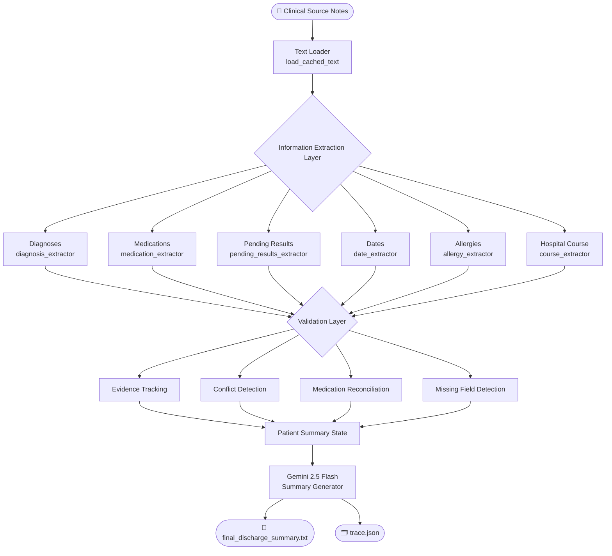

<div align="center">

# 🏥 AI Clinical Discharge Summary Agent 

### Agentic AI system for safe, evidence-backed clinical discharge summary generation

[](https://python.org)
[](https://deepmind.google/technologies/gemini/)
[](LICENSE)
[]()
[]()

*AI Engineer Take-Home Assignment Submission*

</div>

---

## 📋 Table of Contents

- [Overview](#overview)
- [Key Features](#key-features)
- [System Architecture](#system-architecture)
- [Agent Loop Design](#agent-loop-design)
- [No-Fabrication Guardrail](#no-fabrication-guardrail)
- [Handling Failures & Conflicts](#handling-failures--conflicts)
- [Repository Structure](#repository-structure)
- [Installation & Setup](#installation--setup)
- [Running the Pipeline](#running-the-pipeline)
- [Generated Outputs](#generated-outputs)
- [Results & Evaluation](#results--evaluation)
- [Limitations](#limitations)
- [Future Improvements](#future-improvements)
- [Assignment Deliverables Checklist](#assignment-deliverables-checklist)
- [Conclusion](#conclusion)

---

## Overview

**Problem:** Clinical source notes are frequently noisy, incomplete, inconsistent, and time-consuming to summarize manually. Errors in discharge summaries pose direct patient safety risks.

**Solution:** An agentic AI pipeline that ingests unstructured clinical notes, extracts structured clinical facts with evidence tracing, validates consistency, detects conflicts, reconciles medications, and generates a structured discharge summary via Gemini 2.5 Flash — without fabricating any information not found in the source text.

> **Design philosophy:** A missing field is always safer than a hallucinated field. Clinical safety is prioritized above summary completeness at every design decision point.

---

## Key Features

| Feature | Description |
|---|---|
| 🔍 **Evidence-Backed Extraction** | Every extracted fact stores its source page number and raw evidence text |
| 🚫 **No-Fabrication Guardrail** | Missing information is labeled `MISSING`; unsupported claims are never generated |
| ⚠️ **Conflict Detection** | Competing or contradictory diagnoses are surfaced explicitly rather than silently resolved |
| 💊 **Medication Reconciliation** | Admission vs. discharge medications are compared; added/stopped/continued drugs are reported |
| 🔎 **Missing Field Detection** | Tracks five critical clinical fields; flags absence rather than inferring values |
| 📋 **Structured Summary Generation** | Gemini 2.5 Flash produces a formatted discharge summary from validated, structured state |
| 🗂️ **Full Trace Logging** | Every pipeline step is logged to `trace.json` for auditability and reproducibility |
| 🛡️ **Robust Failure Handling** | Empty results, extraction errors, and LLM failures are handled gracefully |

---

## System Architecture

The pipeline follows a linear agentic flow: raw text → structured extraction → validation → LLM generation → output artifacts.



---

## Agent Loop Design

### Step-by-Step Execution

| Step | Module | Output |
|---|---|---|
| 1. Load Notes | `load_cached_text.py` | Raw page-level text |
| 2. Extract Diagnoses | `diagnosis_extractor.py` | `DiagnosisFact[]` with evidence |
| 3. Extract Medications | `medication_extractor.py` | `MedicationFact[]` with dosage, frequency |
| 4. Extract Pending Results | `pending_results_extractor.py` | `PendingResult[]` |
| 5. Extract Dates | `date_extractor.py` | Admission / discharge dates |
| 6. Extract Allergies | `allergy_extractor.py` | Allergy list |
| 7. Extract Hospital Course | `course_extractor.py` | Narrative text |
| 8. Detect Conflicts | `conflict_detector.py` | `Conflict[]` |
| 9. Reconcile Medications | `medication_reconcile.py` | Added / stopped / continued |
| 10. Generate Summary | `gemini_summary.py` | Structured discharge summary |
| 11. Log Trace | `trace_logger.py` | `trace.json` |


Each extracted fact carries its source page number and raw evidence string, making every pipeline decision traceable to the original document.

---

## No-Fabrication Guardrail

This is the most critical safety property of the system.

### How It Works

1. **Evidence-only generation** — Gemini receives only facts that were extracted with supporting evidence from the source notes.
2. **Missing data handling** — Fields that cannot be extracted are passed to the summary generator as the literal string `MISSING`, which is reproduced verbatim in the output.
3. **Unsupported claim rejection** — No default values, interpolations, or "reasonable assumptions" are made for absent clinical data.
4. **Conflict surfacing** — Contradictions are passed to the generator as explicit conflicts rather than silently resolved in either direction.
5. **Validation-first flow** — Evidence is validated before summary generation; the generator receives structured state, not raw notes.

### Safety Guarantees

```
❌ Never invented:   Diagnoses, medications, dosages, dates, allergies
✅ Always explicit:  MISSING labels for unavailable fields
✅ Always surfaced:  Conflicts rather than silent resolution
✅ Always traceable: Page number + raw evidence for every fact
```

### Example

```text
Discharge Condition:
MISSING

Admission Date:
MISSING
```

The system will never substitute a plausible-sounding value. Clinical safety takes precedence over a complete-looking document.

---

## Handling Failures & Conflicts

| Failure Scenario | Detection Method | Recovery Strategy |
|---|---|---|
| Missing admission/discharge date | Pattern-based date extractor returns empty | Field labeled `MISSING` in output |
| Conflicting diagnoses | `conflict_detector.py` checks diagnosis list diversity | Surfaced as `Conflict` object; included in summary |
| Empty medication list | Extractor returns `[]` | Medication section left empty; no inference made |
| Missing allergy information | Keyword matching returns nothing | `MISSING` label used |
| Incomplete hospital course | Section heuristic finds no matching segment | `MISSING` label used |
| Extraction error | Try/catch in individual extractors | Error logged to trace; section preserved as empty |
| LLM generation failure | Caught in `gemini_summary.py` | Error logged; raw structured state preserved |
| OCR noise in medication names | Rule-based extraction may match partial tokens | False positives are possible; noted as a limitation |

---

## Repository Structure

```
discharge-agent/
│
├── app/
│   ├── agents/
│   │   ├── gemini_summary.py          # Gemini 2.5 Flash summary generation
│   │   └── summary_generator.py       # Prompt construction and output formatting
│   │
│   ├── state/
│   │   ├── schemas.py                 # Pydantic data models (DiagnosisFact, MedicationFact, etc.)
│   │   └── agent_state.py             # Patient summary state container
│   │
│   └── tools/
│       ├── diagnosis_extractor.py     # Diagnosis identification
│       ├── medication_extractor.py    # Rule-based medication extraction
│       ├── pending_results_extractor.py  # Unresolved investigation detection
│       ├── medication_reconcile.py    # Admission vs. discharge reconciliation
│       ├── conflict_detector.py       # Contradiction detection
│       ├── date_extractor.py          # Admission/discharge date parsing
│       ├── allergy_extractor.py       # Allergy keyword matching
│       ├── course_extractor.py        # Hospital course section extraction
│       ├── trace_logger.py            # Step-level audit logging
│       └── load_cached_text.py        # Source note text loader
│
├── outputs/
│   ├── final_discharge_summary.txt    # Generated discharge summary
│   └── trace.json                     # Full execution trace
│
├── main.py                            # Pipeline entrypoint
├── requirements.txt                   # Python dependencies
└── README.md
```

| Directory / File | Purpose |
|---|---|
| `app/agents/` | LLM interaction and summary generation logic |
| `app/state/` | Data schemas and shared pipeline state |
| `app/tools/` | Modular extractors and validators |
| `outputs/` | Final artifacts: discharge summary and trace log |
| `main.py` | Orchestrates the end-to-end pipeline |

---

## Installation & Setup

### Prerequisites

- Python 3.10+
- A valid Gemini API key

### 1. Clone the Repository

```bash
git clone https://github.com/<your-username>/discharge-agent.git
cd discharge-agent
```

### 2. Create a Virtual Environment

```bash
python -m venv venv
source venv/bin/activate      # macOS / Linux
venv\Scripts\activate         # Windows
```

### 3. Install Dependencies

```bash
pip install -r requirements.txt
```

### 4. Configure Environment Variables

Create a `.env` file in the project root:

```env
GEMINI_API_KEY=your_api_key_here
```

---

## Running the Pipeline

### End-to-End Execution

```bash
python main.py
```

This will:

1. Load cached source note text
2. Run all extraction modules
3. Validate and reconcile findings
4. Generate the discharge summary via Gemini
5. Write outputs to `outputs/`

### Expected Console Output

```
[INFO] Loading source notes...
[INFO] Extracting diagnoses...        → 2 diagnoses found
[INFO] Extracting medications...      → 13 medications found
[INFO] Extracting pending results...  → 1 pending result found
[INFO] Detecting conflicts...         → 1 conflict found
[INFO] Generating summary...          → summary generated successfully
[INFO] Outputs written to outputs/
```

---

## Generated Outputs

| Artifact | Location | Purpose |
|---|---|---|
| Discharge Summary | `outputs/final_discharge_summary.txt` | Structured clinical discharge summary for clinical review |
| Execution Trace | `outputs/trace.json` | Step-by-step audit log for debugging and traceability |

### Trace Log Example

```json
[
  { "action": "extract_diagnoses",       "result": "2 diagnoses found" },
  { "action": "extract_medications",     "result": "13 medications found" },
  { "action": "extract_pending_results", "result": "1 pending results found" },
  { "action": "detect_conflicts",        "result": "1 conflicts found" },
  { "action": "generate_summary",        "result": "summary generated successfully" }
]
```

### Discharge Summary Sections

- Diagnoses
- Medications (with reconciliation: added / stopped / continued)
- Potential Conflicts
- Admission & Discharge Dates
- Allergies
- Pending Results
- Hospital Course
- Discharge Instructions

---

## Results & Evaluation

| Capability | Status |
|---|---|
| Evidence tracking on all extracted facts | ✅ Implemented |
| Medication reconciliation (added/stopped/continued) | ✅ Implemented |
| Conflict detection across diagnoses | ✅ Implemented |
| Missing field detection for 5 critical fields | ✅ Implemented |
| Full execution trace logging | ✅ Implemented |
| Gemini-based structured summary generation | ✅ Implemented |
| No-fabrication policy enforcement | ✅ Implemented |

**Reliability observations:**
- The pipeline completes end-to-end without errors on well-formed clinical notes.
- Missing fields are handled safely and consistently.
- Medication extraction is functional but sensitive to OCR noise (see Limitations).

---

## Limitations

| Limitation | Impact |
|---|---|
| Medication extraction is rule-based | May produce false positives from OCR artifacts or abbreviation collisions |
| Date extraction is pattern-based | May miss non-standard date formats |
| Conflict detection checks only diagnosis diversity | Does not detect contradictions within medications or vitals |
| Allergy extraction uses keyword matching | May miss phrased or negated allergy mentions |
| Hospital course relies on heuristic section headers | Will fail if notes lack conventional section markers |
| Admission medication list is empty | Reconciliation only reflects discharge additions; no true diff against admission |
| No clinician review loop | The generated summary is not verified by a human before output |

---

## Future Improvements

| Priority | Improvement |
|---|---|
| 🔴 High | LLM-assisted extraction replacing rule-based patterns |
| 🔴 High | True admission/discharge medication reconciliation |
| 🟠 Medium | Multi-pass verification agent for self-consistency checks |
| 🟠 Medium | Confidence scoring on extracted facts |
| 🟠 Medium | Human-in-the-loop clinician review integration |
| 🟡 Low | Structured clinical ontology mapping (SNOMED CT, RxNorm) |
| 🟡 Low | LangGraph-based orchestration for more complex agent flows |
| 🟡 Low | Automated evaluation metrics (ROUGE, BERTScore, clinical NLP benchmarks) |
| 🟡 Low | Continuous learning loop from clinician corrections |

---

## Assignment Deliverables Checklist

- [x] Source Code
- [x] Run Instructions
- [x] Generated Discharge Summary (`outputs/final_discharge_summary.txt`)
- [x] Step Traces (`outputs/trace.json`)
- [x] README
- [ ] Video Demonstration *(add link here)*

---

## Conclusion

This system was engineered with a clear priority ordering: **clinical safety first, completeness second**.

Every architectural decision — evidence tracing, explicit `MISSING` labels, conflict surfacing, audit logging — reflects the principle that a transparent gap in information is always preferable to a confidently wrong one.

The pipeline is modular, auditable, and designed for extension: each extractor, validator, and generator is independently testable, and the trace log provides full reproducibility of every run.

---

<div align="center">

*Built with clinical safety as a first-class engineering constraint.*

</div>
